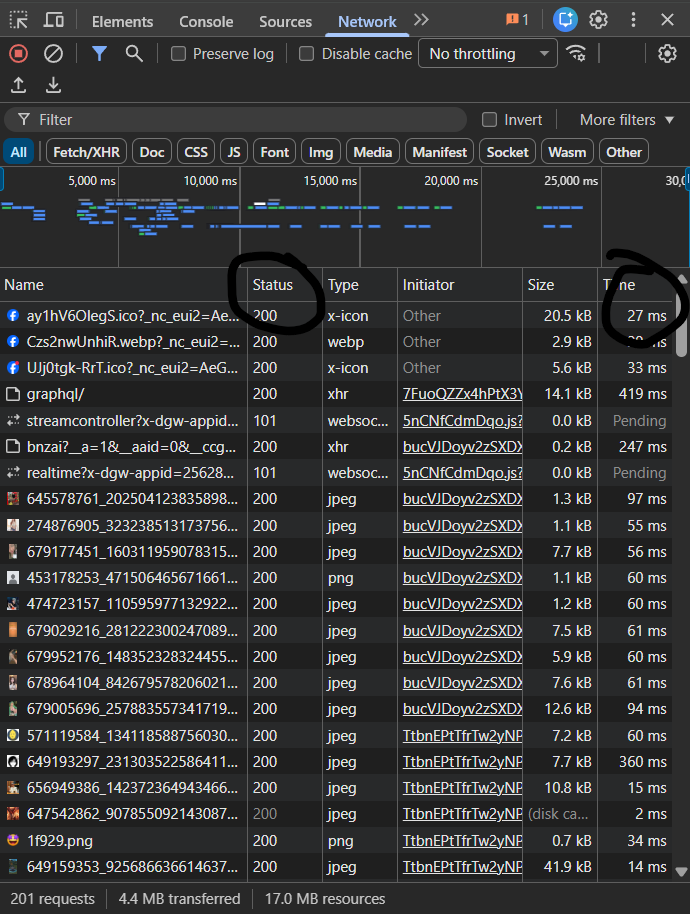

# Câu A1 http & browser

## Các bước xảy ra khi bạn gõ https://shopee.vn và ấn Enter trên trình duyệt
> *Phần 1*
1. Bạn gõ https://shopee.vn vào trình duyệt web
2. DNS sẽ giúp dịch tên website bạn vừa nhập thành địa chỉ ip.
3. Máy của bạn sẽ gửi yêu cầu đến Ip mà DNS vừa dịch cho bạn(server của shopee)
4. Shopee sẽ trả về dữ liệu của trang web shopee
5. Trình duyệt giúp đọc lại các file này và trình ra giao diện để mọi người thao tác

>*Phần 2*

    Trong tab Network của Google Chrome DevTools, bạn có thể theo dõi toàn bộ các request/response giữa trình duyệt và server khi tải hoặc tương tác với một trang web.

  

  # Câu A2 
    Lỗi 1: 
        Dùng 
 thay vì <header>

    Sai:

        

    Sửa:

        <header>

    Vì: header giúp máy tìm kiếm nhận biết đây là phần đầu trang.
    Lỗi 2:
        Menu không dùng thẻ <nav>

        Menu hiện tại:

            

            
<a href="/">Trang chủ</a>

            
<a href="/products">Sản phẩm</a>

        

        Không rõ đây là điều hướng. 
        Sửa lại:
            <nav>
                <ul>
                    <li><a href="/">Trang chủ</a></li>
                    <li><a href="/products">Sản phẩm</a></li>
                </ul>
            </nav>
        Lỗi 3: 
            Ảnh thiếu thuộc tính alt
            Sai:
                

            Sửa:
                

            Lý do: Google đọc alt để hiểu ảnh.
        Lỗi 4:
            Footer dùng div thay vì <footer>
                Sai:
                    

                Sửa:
                    <footer>
# Câu A3
    Kết quả:
    Hộp 1
    Text A Text B
    Hộp 2
    Text C Text D
    Hộp 3
    Giải thích:
        
 là block → chiếm cả dòng, tự xuống dòng.
         và <strong> là inline → nằm cùng một dòng.
    Vì vậy:
        Hộp 1, Hộp 2, Hộp 3 mỗi cái một dòng riêng.
        Text A Text B cùng dòng.
        Text C Text D cùng dòng (strong chỉ in đậm, vẫn là inline).

# Câu A4
    thead: chứa phần tiêu đề của bảng (tên cột).
    tbody: chứa dữ liệu chính của bảng.
    tfoot: chứa phần cuối bảng, thường dùng tổng kết/tổng cộng.
    Không nên dùng table để tạo layout vì:
1. Sai semantic: table dành cho dữ liệu dạng bảng, không phải bố cục trang.
2. SEO và accessibility kém: công cụ tìm kiếm và trình đọc màn hình khó hiểu cấu trúc trang.
3. Khó responsive: khó thiết kế phù hợp mobile hơn Flexbox/Grid.
4. Khó bảo trì: code rối, khó chỉnh sửa.

# Câu B3
Lỗi 1: Dòng 1 — <!DOCTYPE> sai cú pháp — sửa thành <!DOCTYPE html>

Lỗi 2: Dòng 2 — thiếu thuộc tính lang trong thẻ html — sửa thành <html lang="vi">

Lỗi 3: Dòng 5 — thẻ title chưa đóng — thêm </title>

Lỗi 4: Dòng 6 — meta charset viết utf8 sai chuẩn — sửa thành UTF-8

Lỗi 5: Dòng 9 — thẻ h1 đóng sai — <h1> ... </h1>

Lỗi 6: Dòng 13 — thẻ a đầu tiên chưa đóng — thêm </a>

Lỗi 7: Dòng 21 — img thiếu dấu ngoặc kép và thiếu alt — sửa: 

Lỗi 8: Dòng 23 — thẻ b đóng sai thứ tự — đổi thành: <strong>25.990.000đ</strong>

Lỗi 9: Dòng 28-35 — hàng tiêu đề bảng dùng td thay vì th, thiếu thead và tbody — bổ sung cấu trúc bảng đúng semantic

Lỗi 10: Dòng 43 — thẻ p trong footer chưa đóng — thêm 

# Câu B4

.png)
.png)

# Câu C2
